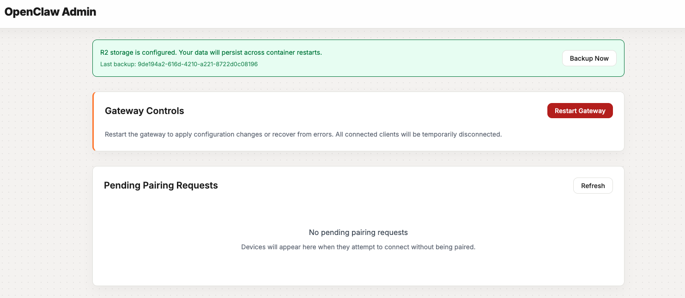

# 在 Cloudflare Workers 上运行 OpenClaw

在 [Cloudflare Sandbox](https://developers.cloudflare.com/sandbox/) 中运行 [OpenClaw](https://github.com/openclaw/openclaw)（曾用名 Moltbot、Clawdbot）个人 AI 助手。


> **实验性项目：** 这是一个概念验证（PoC），用于展示 OpenClaw 可以运行在 Cloudflare Sandbox 中。该方案并非官方支持，可能在无预告情况下发生变化。请自行评估风险后使用。

[](https://deploy.workers.cloudflare.com/?url=https://github.com/cloudflare/moltworker)

## 运行要求

- [Workers 付费计划](https://www.cloudflare.com/plans/developer-platform/)（$5/月）—— Cloudflare Sandbox 容器必需。容器运行会产生额外计算费用，见下方[容器费用估算](#容器费用估算)。
- Cloudflare AI Gateway 配置（`CLOUDFLARE_AI_GATEWAY_API_KEY`、`CF_AI_GATEWAY_ACCOUNT_ID`、`CF_AI_GATEWAY_GATEWAY_ID`）—— 生产环境必需

本项目使用到的以下 Cloudflare 功能提供免费额度：
- Cloudflare Access（身份认证）
- Browser Rendering（浏览器渲染）
- AI Gateway（可选，用于 API 路由/分析）
- R2 Storage（可选，用于持久化）

## 容器费用估算

本项目使用 `standard-1` Cloudflare Container 实例（1/2 vCPU，4 GiB 内存，8 GB 磁盘）。以下是按容器 24/7 运行估算的月成本（参考 [Cloudflare Containers 定价](https://developers.cloudflare.com/containers/pricing/)）：

| 资源 | 预配置 | 月使用量 | 免费额度 | 超出部分 | 估算费用 |
|------|--------|----------|----------|----------|----------|
| 内存 | 4 GiB | 2,920 GiB-hrs | 25 GiB-hrs | 2,895 GiB-hrs | ~$26/月 |
| CPU（按 ~10% 利用率） | 1/2 vCPU | ~2,190 vCPU-min | 375 vCPU-min | ~1,815 vCPU-min | ~$2/月 |
| 磁盘 | 8 GB | 5,840 GB-hrs | 200 GB-hrs | 5,640 GB-hrs | ~$1.50/月 |
| Workers 付费计划 | | | | | $5/月 |
| **总计** | | | | | **~$34.50/月** |

说明：
- CPU 按**活跃使用量**计费，不按预配容量计费。上面的 10% 利用率只是轻量个人助手场景的粗略估计，实际费用会随使用情况变化。
- 内存和磁盘按容器运行期间的**预配容量**持续计费。
- 若要降本，可配置 `SANDBOX_SLEEP_AFTER`（如 `10m`），让容器空闲时休眠。如果每天只运行 4 小时，计算资源成本大致可降到 ~$5-6/月（另加 $5 计划费）。
- 网络出流量、Workers/Durable Objects 请求、日志也会计费，但在个人场景通常较小。
- 其他实例规格可参考[实例类型表](https://developers.cloudflare.com/containers/pricing/)（例如 `lite` 256 MiB / ~$0.50/月内存，或 `standard-4` 12 GiB 适合重负载）。

## 什么是 OpenClaw？

[OpenClaw](https://github.com/openclaw/openclaw)（曾用名 Moltbot、Clawdbot）是一个基于网关架构的个人 AI 助手，可连接多个聊天平台。核心特性包括：

- **Control UI**：网关自带 Web 聊天界面
- **多渠道支持**：Telegram、Discord、Slack
- **设备配对**：需要显式批准的安全认证流程
- **会话持久化**：跨会话保留聊天历史和上下文
- **Agent Runtime**：可扩展的 AI 能力（工作区与技能）

本项目将 OpenClaw 封装到 [Cloudflare Sandbox](https://developers.cloudflare.com/sandbox/) 容器中运行，实现托管、常驻部署而无需自建主机。可选接入 R2 后，可在容器重启后保留数据。

## 架构


## 快速开始

_Cloudflare Sandboxes 仅在 [Workers 付费计划](https://dash.cloudflare.com/?to=/:account/workers/plans) 可用。_

```bash
# 安装依赖
npm install

# 设置 Cloudflare AI Gateway（生产必需）
npx wrangler secret put CLOUDFLARE_AI_GATEWAY_API_KEY
npx wrangler secret put CF_AI_GATEWAY_ACCOUNT_ID
npx wrangler secret put CF_AI_GATEWAY_GATEWAY_ID

# 可选：指定主模型（默认即 GLM-4.7）
npx wrangler secret put CF_AI_GATEWAY_MODEL
# 输入：workers-ai/@cf/zai-org/glm-4.7-flash

# 生成并设置 gateway token（远程访问必需）
# 请保存该 token，后续访问 Control UI 需要用到
export MOLTBOT_GATEWAY_TOKEN=$(openssl rand -hex 32)
echo "Your gateway token: $MOLTBOT_GATEWAY_TOKEN"
echo "$MOLTBOT_GATEWAY_TOKEN" | npx wrangler secret put MOLTBOT_GATEWAY_TOKEN

# 部署
npm run deploy
```

部署后，使用 token 打开 Control UI：

```
https://your-worker.workers.dev/?token=YOUR_GATEWAY_TOKEN
```

将 `your-worker` 替换为你的 worker 子域，将 `YOUR_GATEWAY_TOKEN` 替换为你刚生成的 token。

**注意：** 首次请求可能需要 1-2 分钟来启动容器。

> **重要：** 在完成以下步骤之前，你无法正常使用 Control UI。你必须：
> 1. 先[配置 Cloudflare Access](#配置管理后台-admin-ui)保护管理后台
> 2. 再通过 `/_admin/` 完成[设备配对](#设备配对)

你通常还会希望开启 [R2 持久化存储](#持久化存储-r2)（可选但强烈建议），这样设备配对与会话历史能在容器重启后保留。

## 配置管理后台（Admin UI）

要使用 `/_admin/` 的设备管理功能，你需要：
1. 给 worker 启用 Cloudflare Access
2. 设置 Access 相关密钥，让 worker 能校验 JWT

### 1）在 workers.dev 上启用 Cloudflare Access

最简单方式是使用 workers.dev 自带的 Cloudflare Access 集成：

1. 打开 [Workers & Pages 控制台](https://dash.cloudflare.com/?to=/:account/workers-and-pages)
2. 选择你的 Worker（例如 `moltbot-sandbox`）
3. 在 **Settings** 的 **Domains & Routes** 中，找到 `workers.dev` 行，点击 `...`
4. 点击 **Enable Cloudflare Access**
5. 复制弹窗中的参数（后续需要 AUD）。**注意：** 弹窗里的 “Manage Cloudflare Access” 链接可能 404，可忽略
6. 配置允许访问的用户：进入侧边栏 **Zero Trust** → **Access** → **Applications**，找到该 worker 应用：
   - 可以将你的邮箱加入 allow list
   - 或配置 Google/GitHub 等身份源
7. 从应用配置中复制 **Application Audience (AUD)**，后续作为 `CF_ACCESS_AUD`

### 2）设置 Access 密钥

启用 Cloudflare Access 后，设置以下 secrets 让 worker 校验 JWT：

```bash
# Cloudflare Access 团队域名（例如 "myteam.cloudflareaccess.com"）
npx wrangler secret put CF_ACCESS_TEAM_DOMAIN

# Access 应用的 AUD（上一步复制的 Application Audience）
npx wrangler secret put CF_ACCESS_AUD
```

团队域名可在 [Zero Trust Dashboard](https://one.dash.cloudflare.com/) 的 **Settings** > **Custom Pages** 中找到（`.cloudflareaccess.com` 前面的子域）。

### 3）重新部署

```bash
npm run deploy
```

现在访问 `/_admin/` 时，会先走 Cloudflare Access 登录。

### 备选方案：手动创建 Access 应用

如果你希望更细粒度控制，可手动创建 Access 应用：

1. 打开 [Cloudflare Zero Trust Dashboard](https://one.dash.cloudflare.com/)
2. 进入 **Access** > **Applications**
3. 新建 **Self-hosted** 应用
4. 将应用域名设为 Worker URL（例如 `moltbot-sandbox.your-subdomain.workers.dev`）
5. 配置受保护路径：`/_admin/*`、`/api/*`、`/debug/*`
6. 配置身份提供者（邮箱 OTP、Google、GitHub 等）
7. 复制 AUD 并按上文设置 secrets

### 本地开发

本地开发请创建 `.dev.vars`：

```bash
DEV_MODE=true               # 跳过 Cloudflare Access + 绕过设备配对
DEBUG_ROUTES=true           # 启用 /debug/*（可选）
```

## 身份认证

默认情况下，moltbot 使用**设备配对**作为认证方式。新设备（浏览器、CLI 等）连接时，必须在 `/_admin/` 人工批准。

### 设备配对

1. 新设备连接 gateway
2. 连接会进入 pending 状态
3. 管理员在 `/_admin/` 批准
4. 设备配对完成，后续可自由连接

这是最安全的方式，因为每个设备都必须显式批准。

### Gateway Token（必需）

远程托管访问 Control UI 时必须携带 gateway token（query 参数）：

```
https://your-worker.workers.dev/?token=YOUR_TOKEN
wss://your-worker.workers.dev/ws?token=YOUR_TOKEN
```

**注意：** 即使 token 正确，新设备仍需要在 `/_admin/` 批准（见上面的设备配对）。

仅在本地开发场景，可在 `.dev.vars` 中设置 `DEV_MODE=true` 来跳过 Cloudflare Access 与设备配对（`allowInsecureAuth`）。

## 持久化存储（R2）

默认情况下，moltbot 数据（配置、已配对设备、会话历史）会在容器重启后丢失。若要跨重启保留数据，请配置 R2。

### 1）创建 R2 API Token

1. 进入 [Cloudflare Dashboard](https://dash.cloudflare.com/) 的 **R2** > **Overview**
2. 点击 **Manage R2 API Tokens**
3. 新建 token，权限选择 **Object Read & Write**
4. 选择 `moltbot-data` bucket（首次部署会自动创建）
5. 复制 **Access Key ID** 和 **Secret Access Key**

### 2）设置 Secrets

```bash
# R2 Access Key ID
npx wrangler secret put R2_ACCESS_KEY_ID

# R2 Secret Access Key
npx wrangler secret put R2_SECRET_ACCESS_KEY

# Cloudflare Account ID
npx wrangler secret put CF_ACCOUNT_ID
```

Account ID 获取方式：在 Cloudflare 控制台点击账户名旁边的三点菜单，选择 “Copy Account ID”。

### 工作机制

R2 使用“备份/恢复”方式实现持久化：

**容器启动时：**
- 若 R2 已挂载且存在备份数据，会恢复到 moltbot 配置目录
- OpenClaw 使用默认路径（无需额外配置）

**运行中：**
- 每 5 分钟有一个 cron 同步任务，将配置同步到 R2
- 也可在 `/_admin/` 手动触发备份

**在 Admin UI：**
- 若 R2 配置完成，会显示 `Last backup: [timestamp]`
- 可点击 `Backup Now` 立即触发同步

若未配置 R2 凭据，moltbot 依然可运行，但数据是临时的（重启即丢）。

## 容器生命周期

默认 `SANDBOX_SLEEP_AFTER=never`，容器会常驻（推荐，因为冷启动约 1-2 分钟）。

若想降低低频使用场景成本，可配置空闲休眠时间：

```bash
npx wrangler secret put SANDBOX_SLEEP_AFTER
# 输入：10m（或 1h、30m 等）
```

容器休眠后，下次请求会触发冷启动。若已配置 R2，则设备与数据仍可在重启后恢复。

## Admin UI



访问 `/_admin/` 可执行：
- **R2 Storage Status**：查看是否配置 R2、上次备份时间、手动备份按钮
- **Restart Gateway**：结束并重启 moltbot gateway 进程
- **Device Pairing**：查看待批准设备、单个/批量批准、查看已配对设备

`src/client/` 下的管理前端使用 Vue + Vite 构建。

Admin UI 默认需要 Cloudflare Access（本地可用 `DEV_MODE=true`）。

## 调试端点（Debug Endpoints）

启用条件：`DEBUG_ROUTES=true` 且通过 Cloudflare Access。路径为 `/debug/*`：

- `GET /debug/processes`：列出容器进程
- `GET /debug/logs?id=<process_id>`：查看指定进程日志
- `GET /debug/version`：查看容器与 moltbot 版本信息

## 可选：聊天渠道

### Telegram

```bash
npx wrangler secret put TELEGRAM_BOT_TOKEN
npm run deploy
```

### Discord

```bash
npx wrangler secret put DISCORD_BOT_TOKEN
npm run deploy
```

### Slack

```bash
npx wrangler secret put SLACK_BOT_TOKEN
npx wrangler secret put SLACK_APP_TOKEN
npm run deploy
```

## 可选：浏览器自动化（CDP）

项目内置了 Chrome DevTools Protocol（CDP）shim，可启用浏览器自动化能力（抓取、截图、自动化测试等）。

### 配置步骤

1. 设置鉴权密钥：

```bash
npx wrangler secret put CDP_SECRET
# 输入一个安全随机字符串
```

2. 设置 worker 的公网 URL：

```bash
npx wrangler secret put WORKER_URL
# 输入：https://your-worker.workers.dev
```

3. 重新部署：

```bash
npm run deploy
```

### 端点

| Endpoint | 说明 |
|----------|------|
| `GET /cdp/json/version` | 浏览器版本信息 |
| `GET /cdp/json/list` | 列出可用 target |
| `GET /cdp/json/new` | 创建新的浏览器 target |
| `WS /cdp/devtools/browser/{id}` | CDP WebSocket 通道 |

所有端点都需要 `?secret=<CDP_SECRET>` 认证。

## 内置 Skills

容器内预装 skills 位于 `/root/clawd/skills/`。

### cloudflare-browser

通过 CDP shim 提供浏览器自动化。需要设置 `CDP_SECRET` 与 `WORKER_URL`（见上节）。

**脚本：**
- `screenshot.js`：对 URL 截图
- `video.js`：从多个 URL 生成视频
- `cdp-client.js`：可复用的 CDP 客户端库

**使用示例：**
```bash
# 截图
node /root/clawd/skills/cloudflare-browser/scripts/screenshot.js https://example.com output.png

# 多 URL 生成视频
node /root/clawd/skills/cloudflare-browser/scripts/video.js "https://site1.com,https://site2.com" output.mp4 --scroll
```

完整文档见 `skills/cloudflare-browser/SKILL.md`。

## Cloudflare AI Gateway（推荐且生产必需）

本项目在生产模式下要求通过 [Cloudflare AI Gateway](https://developers.cloudflare.com/ai-gateway/) 转发模型请求，以获得缓存、限流、分析和成本追踪能力。OpenClaw 已将 Cloudflare AI Gateway 作为一等提供方支持。

AI Gateway 位于 OpenClaw 与上游模型（如 Anthropic）之间。请求会发送到
`https://gateway.ai.cloudflare.com/v1/{account_id}/{gateway_id}/anthropic`，而不是直接发送到 `api.anthropic.com`。你依然需要上游提供方 API Key（例如 Anthropic Key）；网关会向上游转发。

### 配置

1. 在 Cloudflare 控制台 [AI Gateway 页面](https://dash.cloudflare.com/?to=/:account/ai/ai-gateway/create-gateway) 创建一个 gateway。
2. 设置三个必需 secrets：

```bash
# 你的模型提供方 API Key（例如 Anthropic）
# 会通过 gateway 转发给上游提供方
npx wrangler secret put CLOUDFLARE_AI_GATEWAY_API_KEY

# Cloudflare account ID
npx wrangler secret put CF_AI_GATEWAY_ACCOUNT_ID

# AI Gateway ID（见 gateway 概览页）
npx wrangler secret put CF_AI_GATEWAY_GATEWAY_ID
```

三者缺一不可。OpenClaw 会用 account id + gateway id 组装网关 URL，并使用 API key 透传到上游提供方。

3. 重新部署：

```bash
npm run deploy
```

Worker 在非 `DEV_MODE` / 非 `E2E_TEST_MODE` 下会校验这三个 Gateway 变量，缺失会直接返回 503 配置错误。

### Dynamic Route（主 GLM，故障回退 Kimi）

你可以在 Cloudflare AI Gateway 控制台配置 Dynamic Route，这样能在控制台可视化看到路由图和回退逻辑。

推荐配置：

- 主模型：`workers-ai/@cf/zai-org/glm-4.7-flash`
- 回退模型：`workers-ai/@cf/moonshotai/kimi-k2.5`
- 回退条件：`5xx`、`429`、超时（按你的容错策略配置）

建议做法：

1. 在 AI Gateway 中新建一个 Route / Dynamic Route 规则
2. 将主模型设为 `@cf/zai-org/glm-4.7-flash`
3. 增加 fallback 目标 `@cf/moonshotai/kimi-k2.5`
4. 保存并发布规则
5. Worker 侧保持 `CF_AI_GATEWAY_MODEL=workers-ai/@cf/zai-org/glm-4.7-flash`

这样当 GLM-4.7 异常时，网关会自动回退到 Kimi，且你可以在控制台中看到完整动态路由图。

### 选择模型

默认使用 `workers-ai/@cf/zai-org/glm-4.7-flash`。若要切换主模型，可设置 `CF_AI_GATEWAY_MODEL`，格式为 `provider/model-id`：

```bash
npx wrangler secret put CF_AI_GATEWAY_MODEL
# 输入：workers-ai/@cf/zai-org/glm-4.7-flash
```

兼容任意 [AI Gateway provider](https://developers.cloudflare.com/ai-gateway/usage/providers/)：

| Provider | `CF_AI_GATEWAY_MODEL` 示例 | API key 应使用 |
|----------|----------------------------|----------------|
| Workers AI | `workers-ai/@cf/zai-org/glm-4.7-flash` | Cloudflare API token |
| Workers AI (fallback) | `workers-ai/@cf/moonshotai/kimi-k2.5` | Cloudflare API token |
| OpenAI | `openai/gpt-4o` | OpenAI API key |
| Anthropic | `anthropic/claude-sonnet-4-5` | Anthropic API key |
| Groq | `groq/llama-3.3-70b` | Groq API key |

**注意：** `CLOUDFLARE_AI_GATEWAY_API_KEY` 必须与当前 provider 对应（它本质上是 provider 的 API key，经 gateway 转发）。通过 gateway 一次只适用于一个 provider。若要多 provider 并行，可结合直接密钥（`ANTHROPIC_API_KEY`、`OPENAI_API_KEY`）使用。

#### 使用 Workers AI Unified Billing

通过 [Unified Billing](https://developers.cloudflare.com/ai-gateway/features/unified-billing/)，你可直接使用 Workers AI 模型，无需额外 provider key。此时将 `CLOUDFLARE_AI_GATEWAY_API_KEY` 设置为 [AI Gateway 认证 token](https://developers.cloudflare.com/ai-gateway/configuration/authentication/)（`cf-aig-authorization` token）。

### 旧版 AI Gateway 配置

历史方案 `AI_GATEWAY_API_KEY` + `AI_GATEWAY_BASE_URL` 仍保留兼容，但已不推荐；建议使用上文原生配置。

## Secrets 全量参考

| Secret | 必需 | 说明 |
|--------|------|------|
| `CLOUDFLARE_AI_GATEWAY_API_KEY` | 是* | 你的 provider API key（如 Anthropic key），通过 gateway 转发。需配合 `CF_AI_GATEWAY_ACCOUNT_ID` 与 `CF_AI_GATEWAY_GATEWAY_ID` |
| `CF_AI_GATEWAY_ACCOUNT_ID` | 是* | Cloudflare account ID（用于组装 gateway URL） |
| `CF_AI_GATEWAY_GATEWAY_ID` | 是* | AI Gateway ID（用于组装 gateway URL） |
| `CF_AI_GATEWAY_MODEL` | 否 | 覆盖默认主模型（默认：`workers-ai/@cf/zai-org/glm-4.7-flash`） |
| `ANTHROPIC_API_KEY` | 否 | 直连 Anthropic API key（仅本地实验建议） |
| `ANTHROPIC_BASE_URL` | 否 | 直连 Anthropic API base URL |
| `OPENAI_API_KEY` | 否 | OpenAI API key（可选 provider） |
| `AI_GATEWAY_API_KEY` | 否 | 旧版 AI Gateway key（已弃用，建议改用 `CLOUDFLARE_AI_GATEWAY_API_KEY`） |
| `AI_GATEWAY_BASE_URL` | 否 | 旧版 AI Gateway endpoint URL（已弃用） |
| `CF_ACCESS_TEAM_DOMAIN` | 是* | Cloudflare Access 团队域名（Admin UI 必需） |
| `CF_ACCESS_AUD` | 是* | Cloudflare Access 应用 audience（Admin UI 必需） |
| `MOLTBOT_GATEWAY_TOKEN` | 是 | Gateway 访问 token（通过 `?token=` 传入） |
| `DEV_MODE` | 否 | 设为 `true` 可跳过 CF Access + 设备配对（仅本地） |
| `DEBUG_ROUTES` | 否 | 设为 `true` 启用 `/debug/*` |
| `SANDBOX_SLEEP_AFTER` | 否 | 容器休眠策略：`never`（默认）或 `10m`、`1h` 等 |
| `R2_ACCESS_KEY_ID` | 否 | R2 Access Key |
| `R2_SECRET_ACCESS_KEY` | 否 | R2 Secret Key |
| `CF_ACCOUNT_ID` | 否 | Cloudflare account ID（R2 需要） |
| `TELEGRAM_BOT_TOKEN` | 否 | Telegram bot token |
| `TELEGRAM_DM_POLICY` | 否 | Telegram DM 策略：`pairing`（默认）或 `open` |
| `DISCORD_BOT_TOKEN` | 否 | Discord bot token |
| `DISCORD_DM_POLICY` | 否 | Discord DM 策略：`pairing`（默认）或 `open` |
| `SLACK_BOT_TOKEN` | 否 | Slack bot token |
| `SLACK_APP_TOKEN` | 否 | Slack app token |
| `CDP_SECRET` | 否 | CDP 端点认证密钥 |
| `WORKER_URL` | 否 | Worker 公网 URL（CDP 需要） |

## 安全注意事项

### 多层认证

在 Cloudflare Sandbox 上运行 OpenClaw 时，采用多层安全：

1. **Cloudflare Access**：保护管理路由（`/_admin/`、`/api/*`、`/debug/*`），仅已认证用户可管理设备。
2. **Gateway Token**：访问 Control UI 必需，通过 `?token=` 传入，需妥善保管。
3. **设备配对**：每个设备（浏览器、CLI、聊天 DM）都需要在 Admin UI 显式批准后才能交互（默认 `pairing` 策略）。

## 故障排查

**`npm run dev` 报 `Unauthorized`：** 需要先在 [Containers dashboard](https://dash.cloudflare.com/?to=/:account/workers/containers) 启用 Cloudflare Containers。

**Gateway 启动失败：** 检查 `npx wrangler secret list` 与 `npx wrangler tail`。

**配置变更不生效：** 修改 `Dockerfile` 中 `# Build cache bust:` 注释并重新部署。

**首次请求慢：** 冷启动通常需要 1-2 分钟，后续请求会更快。

**R2 挂载失败：** 确认已设置 `R2_ACCESS_KEY_ID`、`R2_SECRET_ACCESS_KEY`、`CF_ACCOUNT_ID`。注意：`wrangler dev` 下不支持 R2 挂载（仅生产环境可用）。

**Admin 路由访问被拒：** 检查 `CF_ACCESS_TEAM_DOMAIN` 和 `CF_ACCESS_AUD` 是否设置正确，并确认 Access 应用配置无误。

**Admin UI 里看不到设备：** 设备列表命令经 WebSocket 建连有 10-15 秒开销，请稍等后刷新。

**本地 WebSocket 异常：** `wrangler dev` 通过 sandbox 代理 WebSocket 有已知限制。HTTP 通常可用，WebSocket 可能失败；完整验证建议部署到 Cloudflare。

## 已知问题

### Windows：Gateway 启动失败（exit code 126，permission denied）

在 Windows 上，Git 可能将 shell 脚本检出为 CRLF，而不是 LF，导致 `start-openclaw.sh` 在 Linux 容器中以 126 失败。请确保仓库使用 LF：
- `git config --global core.autocrlf input`
- 或增加 `.gitattributes`：`* text=auto eol=lf`

详情见 [#64](https://github.com/cloudflare/moltworker/issues/64)。

## 相关链接

- [OpenClaw](https://github.com/openclaw/openclaw)
- [OpenClaw Docs](https://docs.openclaw.ai/)
- [Cloudflare Sandbox Docs](https://developers.cloudflare.com/sandbox/)
- [Cloudflare Access Docs](https://developers.cloudflare.com/cloudflare-one/policies/access/)
